# 시니어를 위한 모임, 친구 만들기 서비스

### 모임 기능 

##### 취미 활동이나 교육, 친목 등 주제로 게시글을 작성하면(제목, 모임 장소, 시간 정보 포함) 장소를 기준으로 가까운 거리에 있는 모임들이 표시됨

### 친구 기능

##### 사람 중심으로 1:1 매칭 서비스

## WireFrame

회원 가입/ 로그인

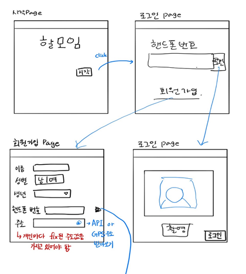

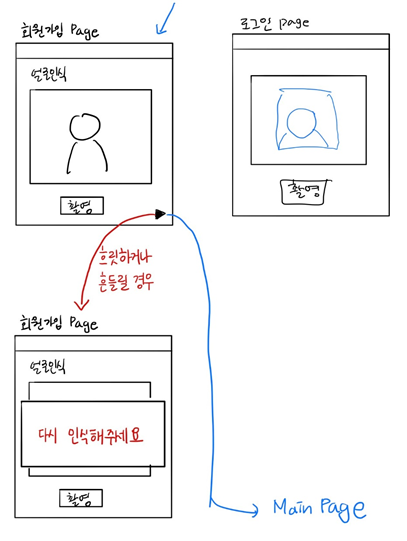

모임

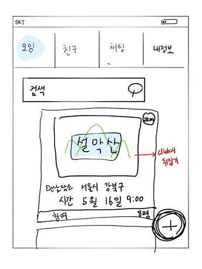

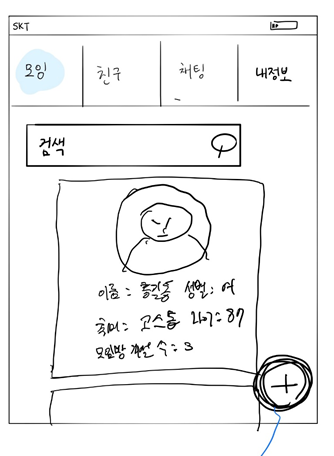

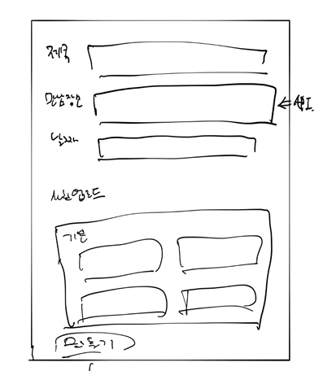

친구 / 채팅

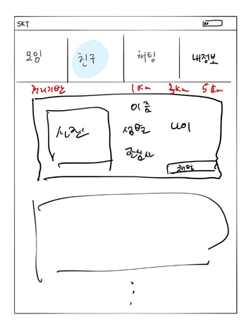

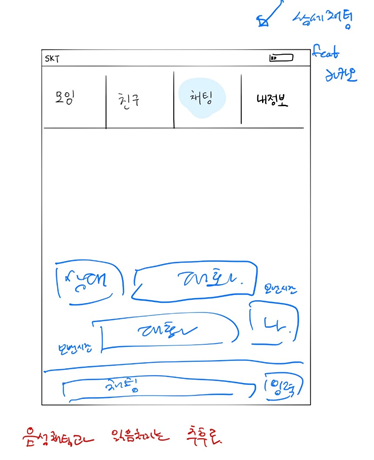

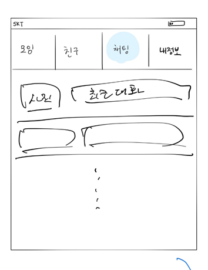

내 정보

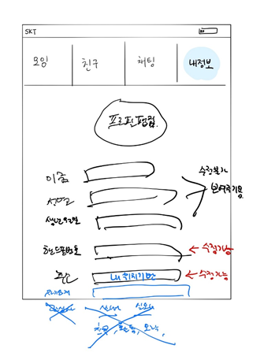

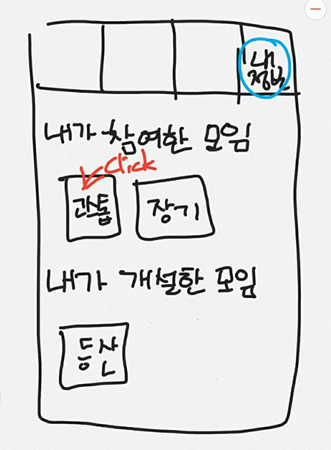

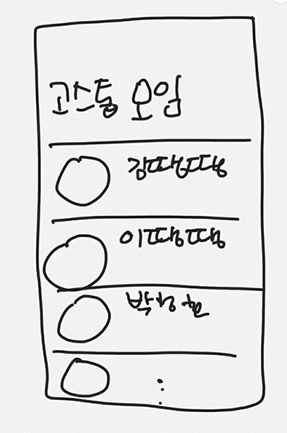

## 환경설정

- Front : React
- Back : Spring boot 
  - STS 4.6.1
  - Java 1.8
  - Python 3.6.8
- DB : MongoDB 4.2.6 
  - Robomongo 
- Docker/Kubernetes
- 서버: AWS