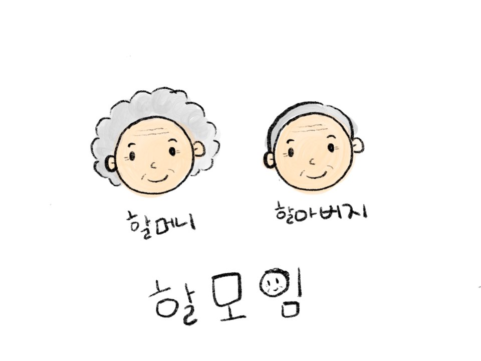

# 시니어를 위한 모임, 친구 만들기 서비스


## 프로젝트 설명

활동적인 노후생활을 추구하며, 미디어 활용능력이 좋은 액티브 시니어들이 가까운 거리를 기반으로 모임이나 친구를 만들 수 있도록 돕는 플랫폼

#### 모임 기능 

취미 활동이나 교육, 친목 등 주제로 게시글을 작성하면(제목, 모임 장소, 시간 정보 포함) 장소를 기준으로 가까운 거리에 있는 모임들이 표시됨

#### 친구 기능

사람 중심으로 1:1 매칭 서비스

#### WireFrame

[WireFrame](readme/wireframe.md)


## 할모임 다운로드 하기

### 깃랩에서 클론하기

```
$ git clone https://lab.ssafy.com/s02-final/s02p31a107.git
```

### Zip파일 다운로드하기

```
$ wget https://lab.ssafy.com/s02-final/s02p31a107/-/archive/master/s02p31a107-master.zip -O halmoim.zip; unzip halmoim.zip; rm halmoim.zip
```


## Front 

- 프로그램을 시작하는데 필요한 모듈 목록이 포함 된 `package.json`

- 종속성을 설치하려면 다음을 실행

```
npm install
```


- 프로그램을 실행하려면 다음 명령어
- http://localhost:3000 포트 3000번으로 실행되어 다음 링크를 따라 확인

```
npm start
```


- material-ui 설치

```
$ npm install @material-ui/core
```


## Back

#### 라이브러리 설치하기

- 객체와 Entity에 필요한 Lombok 설치
  - 설치방법: https://duzi077.tistory.com/142


#### API 확인

http://localhost:8080/swagger-ui.html